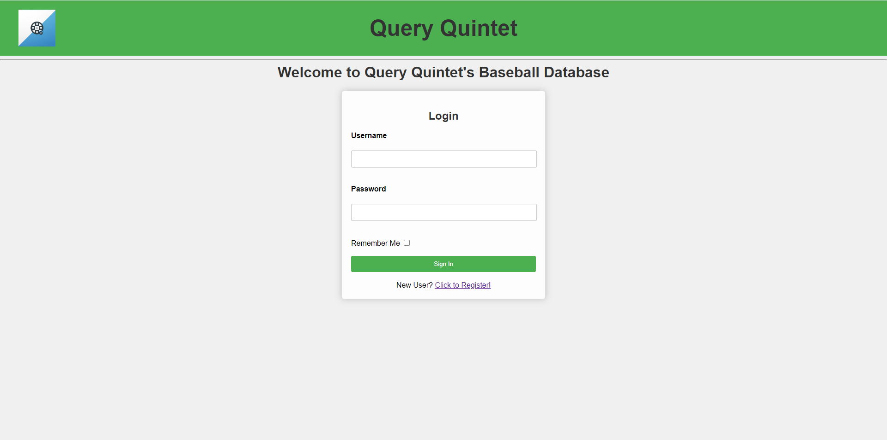

# CSI3335 Group Project QueryQuintet

This repository is the QueryQuintet Team repository. 

# Database Setup:

1. Log in to mysql.

2. If you have not already created the QueryQuintet database, do so by entering 
```SQL
CREATE DATABASE QueryQuintet
```

3. Enter the database by entering
```SQL
USE QueryQuintet
```

4. Run the absolute path of QueryQuintet.sql, using the command:

```Bash
\. <Absolute Path Here>
```

5. The database is ready!
7. In the project's app folder, modify csi3335F2023.py as needed to match the mysql user information.
6. In the project folder terminal while using the project virtual environment enter:
```Bash
flask run
```
7. Open a tab to: http://localhost:5000
8. You should see this login page

9. Default admin username is "admin" and password is "admin"
10. After login, it is recommended to update password from home page button "Update Password"
11. Any additional users will not have access to query statistics under the User Accounts page

# Updates to the Lahman Baseball Database

Using .csv files updated through the 2022 season

## Introduction

This document is a summary of changes that we made to the Lahman baseball database using .csv files updated through the 2022 MLB season (the Lahman database was only updated through the 2021 season). Our assumption was that the data in the .csv files (the “new” data) was correct unless we found irrefutable evidence to the contrary, and that the data in the Lahman database (the “old data”) was correct unless it disagreed with the .csv files. Below, we summarize our updates (if any) to each of the 23 tables in the Lahman database.

## Process

Before executing any Python code, we ran an SQL script on the database that removed all rows from most of the tables. For the tables whose rows were removed, we also reset their AUTO_INCREMENT to 1. We then wrote a Python program to update each table with the new data. We used pandas dataframes and SQLAlchemy. For the sake of continuity, it would have been better to remove all rows using those Python programs rather than an SQL script, but this was not possible due to foreign key constraints (e.g. the people table was the last one to have its old data removed and the first one to get the new data, because so many tables have foreign key constraints requiring their PlayerIDs to be in the people table).

One change in particular was applied to all tables: any column named “ID” was renamed to “tablename_ID” because columns that do not refer to the same thing should not have the same name. This will make join operations easier.

Also, for a significant number of tables, the column lgID was included in the .csv files but not included in the old database. In such cases, we disregarded that column in the .csv files because it contained data that was already in the teams table—redundant data.

## allstarfull

We removed all old rows and added all new rows; however, as we were adding new rows, we checked for duplicate rows in the .csv file, because the 1962 season contained several rows with the exact same data. We only added one instance of each of these rows. We also removed the gameNum column entirely, as gameID functionally determines gameNum, and a user can determine which game was first by looking at the date within the gameID. We kept, however, the lgID column, even though teamID and yearID functionally determines lgID, because lgID is an essential part of the All-Star Game.

## appearances

We removed all old rows and added all new rows. 1683 rows from the 2022 season were added. One row, with PlayerID ‘thompan01’ and YearID 1875, did not match any person in the people table in the old or new data. However, it seems that ‘thompan01’ was in the database at some point in the past, as there exists a player with PlayerID ‘thompan02’. our guess is that ‘thompan01’ was removed from the database due to doubts about his identity. In his 2012 book, *The Rank and File of 19th Century Major League Baseball: Biographies of 1,084 Players, Owners, Managers and Umpires*, David Nemec writes about a player named Andrew Thompson who played in 11 games, which matches the total from the row in the .csv file. He writes: “ours is the first contemporary reference work to commit to combining the career achievements of Thompson the player and Thompson the manager…[which] is not recognized by any other current reference sources, including the official records of Major League Baseball” ([link](https://books.google.com/books?id=TFNK7be-KGcC&printsec=frontcover#v=onepage&q=thompson&f=false)). We accepted Nemec’s information about Andrew Thompsan as factual, adding him to the people table using biographical information provided by Nemec and including the spurious row in the appearances table.

## awards

The old data was only updated through the 2017 season, whereas the .csv files are updated through the 2021 season. 295 rows were added from 2018-2021. We also added 164 rows for awards from the 2022 and 2023 seasons. We collected this data ourselves, as it was not in the .csv file.

## awardsshare

This table is only updated through the 2016 season, both in the database and in the CSVs. we removed all old rows and added all new ones. The only change is that the votesFirst column in some rows is now listed as NULL instead of 0.

## batting

All old rows were removed and all new rows were added. 1686 new rows were added from the 2022 season. The new rows from the .csv also contained corrections to old rows: for example, the player with PlayerID ‘cranesa01’ was credited with one stolen base in his third stint of the season (his second stint with the giants). Most notably, three new rows from before 2022 were added: Con Daily’s 1896 stint with the Brooklyn Bridegrooms (in which he only recorded one plate appearance), Jack Mayfield’s second stint with the Angels in 2021, and Connor Greene’s second stint with the Orioles in 2021. In the old data, Mayfield’s stats and Connor’s stats during their two stints were combined into one stint. This table seems to have issues with players with two stints with the same team in a year.

## battingpost

All old rows were removed and all new rows were added. 495 new rows from the 2022 season were added. No new rows from before 2022 were added, but 7 rows from before 2022 were modified—for example, Eric Hosmer is now credited with a double in the 2014 ALDS which was previously credited as a single and an error on the right fielder Kole Calhoun, who misplayed the ball ([watch](https://youtu.be/qfsKIU00btw?t=178)). This change is also reflected in Kole Calhoun’s stats in fieldingpost.

## collegeplaying

The old database rows and the new .csv rows were identical apart from two additional rows in the .csv with SchoolID ‘caallia’. We disregarded those two rows, as that SchoolID does not match any school in the old or new data.

## divisions

There were no updates to this table (aside from the ID column being renamed). The old and new data are identical.

## fielding

The new data is split into three .csv files: Fielding.csv, FieldingOF.csv, and FieldingOFsplit.csv. Fielding.csv combines all outfield statistics in a stint into one row with position ‘OF’. FieldingOFsplit.csv breaks up each outfielder’s statistics among the three outfield positions, but only for years after 1953. FieldingOF.csv shows how many games outfielders played at each outfield position for years before 1956, but does not show their stats during those games. We disregarded FieldingOF.csv because the appearances table already contains data about games in the three outfield positions before 1954.

We removed all old rows and added all new rows from Fielding.csv, except for rows with position ‘OF’ and yearid >= 1954. Then, we added all rows from FieldingOFsplit.csv. There are now a total of 165855 rows in the fielding table: 2638 new rows were added from 2022, and a few minor updates were made to rows before 2022—like the batting table, there are apparent issues with players who played multiple stints for the same team in the same year.

## fieldingpost

All old rows were removed and all new rows were added. The columns f_CS and f_SB were removed entirely, as they contain only zero or NULL values in the old and new data. 478 rows from the 2022 season were added, and there are updates to rows before the 2022 season (such as Kole Calhoun’s non-error from the 2014 ALDS, which is described in the battingpost section of this document), but no new rows before 2022 are added. Jose Vizcaino’s stats from the 2000 ALCS, which were separated between 2B and 3B in the old data, are combined into one row, with position 2B. This confusion likely occurred because Vizcaino pinch-hit for 3B Scott Brosius in Game 6 but switched to 2B on the field, while Luis Sojo switched from 2B to 3B. In total, the new table contains 15540 rows.

## franchises

No updates were made to this table. The old and new data are identical.

## halloffame

All old rows were removed and all new rows were added. Only two updates were made: Billy Wagner is now listed as receiving 71 votes in 2019 instead of 73, and Andy Pettite is now listed as receiving 42 votes in 2019 instead of 41. Baseball reference agrees with the new data.

## homegames

31 new rows from the 2022 season were added, with the extra row being the Field of Dreams game at a neutral site (CHC@CIN). In the new data before 2022, there was significant data loss, particularly in 2020, where 50 rows in the old data were consolidated into 30 rows in the new data because all teams were assumed to have played all their home games at their home ballparks. For example, [this game](https://www.baseball-reference.com/boxes/NYN/NYN202008252.shtml) featured the Mets and Marlins at Citi Field, but the Marlins were considered the home team. The old data correctly shows that the Marlins played a home game at Citi Field, but the new data does not. As a result, we disregarded the new data from before 2022, and kept the old data.

## leagues

No updates were made to this table. The old and new data are identical.

## managers

The new data is split into Managers.csv and ManagersHalf.csv. Managers.csv contains rows for all seasons through 2022, while ManagersHalf.csv also has a ‘half’ attribute that indicates the half of the season (for the 1892 and 1981 seasons only, which are the only seasons included in ManagersHalf.csv). we did the following:

1. added a ‘half’ column to the managers table
2. removed all old rows
3. added all rows from Managers.csv
4. added all rows from ManagersHalf.csv
5. deleted old rows from the 1892 and 1981 seasons (where half was NULL)

34 new rows from the 2022 season were added.

## parks

No updates were made to this table. The old and new data are identical.

## people

All old rows were removed, unless the PlayerID from the old row did not exist in the new data (which was only a few people), and all new rows were added. Columns retroID and bbrefID in People.csv were disregarded. New people were added and numerous updates were made to old people.

## pitching

All old rows were removed and all new rows were added. 971 new rows from the 2022 season were added. Updates were made to 13 old rows, including Connor Greene’s 2021 stint with the Orioles being correctly split into two stints.

## pitchingpost

All old rows were removed and all new rows were added. When a pitcher’s ERA was infinite (earned runs allowed but no outs recorded), PitchingPost.csv listed the ERA as ‘inf’, which we changed to NULL while loading the data.

## salaries

No updates were made to the data in this table (aside from the ID column being renamed). We confirmed that the old and new data are identical. However, we removed the lgID column from the database, as it contains redundant data.

## schools

No updates were made to this table. It is possible that the new data contained updates to old rows, but we did not use the .csv file at all. It is missing three rows that are present in the old data.

## seriespost

All old rows were removed and all new rows were added. 11 new rows were added from the 2022 season. The column “loses” was renamed to “losses”.

## teams

30 new rows were added from the 2022 season, but the new data from before 2022 was disregarded because there was significant data loss in the new data, including 50 rows where lgID ‘NA’ (for the National Association, which was active from 1871-1875) was changed to NULL, and 5 rows where the value for the park_name column was changed to the park’s new name: U.S. Cellular Field was renamed to Guaranteed Rate Field in the new data, and Rangers Ballpark in Arlington was renamed to Globe Life Park, even though those were not the names of those ballparks at the time.

The Los Angeles Angels of Anaheim changed their name to simply ‘Los Angeles Angels’ before the start of the 2016 season, and that change, which was not reflected in the new data, is now reflected in the database.

Pythagorean projections of team wins and losses are now in the teams table, using the formula win% = (runs scored ^ 1.83) / [(runs scored ^ 1.83) + (runs allowed ^ 1.83)].
